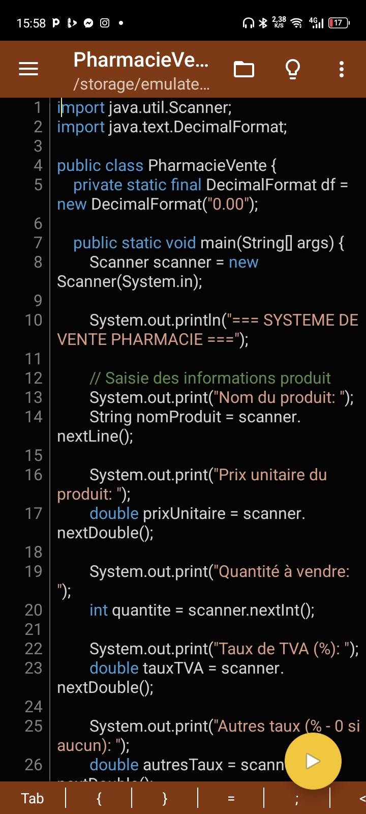

# 💊 PharmaVente - Système de Gestion pour Pharmacie (Mobile Java)

## 📱 Contexte Mobile
**Premier projet Java complet développé entièrement sur smartphone Android** avec :
- ▶️ **Jvdroid** : Édition du code et exécution rapide
- 🔄 **Termux** : Compilation avancée via `javac`
- 📦 **GitHub Mobile** : Gestion de version professionnelle

## 🛠️ Configuration Requise
| Outil | Lien d'Installation | Version |
|-------|---------------------|---------|
| Jvdroid | [Play Store](https://play.google.com/store/apps/details?id=ru.iiec.jvdroid) | 3.2+ |
| Termux | [F-Droid](https://f-droid.org/packages/com.termux/) | 0.118+ |
| JDK | `pkg install openjdk-17` | 17+ |

## 🏗️ Structure Optimisée pour Mobile

Une application console Java simple pour simuler la vente de produits en pharmacie, avec génération de facture incluant les taxes.

## 📌 Objectif

Digitaliser la vente des produits dans une pharmacie locale à travers un petit module qui :
- Saisit les informations du produit à vendre
- Calcule les montants avec TVA et autres taxes
- Affiche une facture lisible et bien présentée

## ⚙️ Fonctionnalités

- Saisie du nom du produit
- Saisie du prix unitaire
- Saisie de la quantité à vendre
- Saisie du taux de TVA
- Saisie d’un taux supplémentaire de taxe (ou 0 si aucun)
- Confirmation de la vente
- Affichage de la facture détaillée :
  - Montant brut
  - Montant TVA
  - Autres taxes
  - Montant total

## 🖥️ Capture d’écran

 
